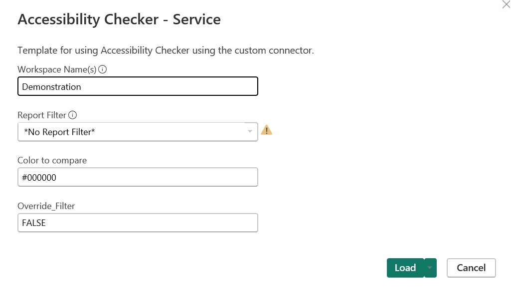

# Power-BI-Accessibility-Checker

Use the Power BI Accessibility Checker to understand whether your Power BI report meets minimum accessibility standards, and find where and how you can make improvements to the accessibility of your report. This checker looks at three top areas for accessibility: Tab Order, Alt Text, and Color Contrast. It also checks the color contrast of your report's selected theme.

*Disclaimer*: This is version 1. Please let me know if you encounter any errors with it.

There are two versions of the Power BI Accessibility Checker:

1. Power BI Accessibility Checker.pbix - This will check areas for accessibility of .pbix files on your desktop.
2. Power BI Accessibility Checker - Service.pbit - This will check areas for accessibility of Power BI reports in a workspace.

# Table of Contents

- [Power-BI-Accessibility-Checker](#power-bi-accessibility-checker)
- [Table of Contents](#table-of-contents)
- [Instructions](#instructions)
  - [Power BI Accessibility Checker.pbix Installation](#power-bi-accessibility-checkerpbix-installation)
  - [Power BI Accessibility Checker - Service.pbit](#power-bi-accessibility-checker---servicepbit)
    - [Install Custom Connector](#install-custom-connector)
  - [Power BI Accessibility Checker - Service (GCC).pbit](#power-bi-accessibility-checker---service-gccpbit)
    - [Install Custom Connector (GCC)](#install-custom-connector-gcc)
    - [Power BI Gateway](#power-bi-gateway)
- [Known Issues](#known-issues)
- [Latest Changes](#latest-changes)

# Instructions

## Power BI Accessibility Checker.pbix Installation
Download the Power BI Field Finder.pbit template file.  

1.  Open the Accessibility Checker.pbix file. You'll see the accessibility checks of the sample WoW 2023 Week 8 sample file. To have it run checks against your files, change the report parameters to point to a location on your computer (and optionally a specific file, or whether to include subfolders). For example, if your pbix file is saved in C:\Test Files and is named "My Report", then the value for this parameter should be "C:\Files" and optionally you can include the name of your report.

2.  Click the Load button, and easily see your tab order and alt text on the following pages. Color contrast is a bit trickier, so for this version you can enter a hex code for a color that you'd like to compare against the colors on your visuals. This color is also compared against the colors of the selected theme.

3.  When you make changes to your pbix file, save it and refresh the Power BI Accessibility Checker.  If you'd like to analyze a different report, update the parameter to the file path and filename of another pbix file.

Further information can be found in this Workout Wednesday post: https://workout-wednesday.com/pbi-2023-w12/

## Power BI Accessibility Checker - Service.pbit

### Install Custom Connector

In order to access the Power BI Reports in the workspace, you'll need to install the custom connector by following the instructions below.

1. Open Power BI Desktop and navigate to File -> Options and Settings -> Options.
2. Navigate to GLOBAL -> Security and under "Data Extensions" choose "Allow any extension..."

Because this is a custom data connector you have to choose this option in order to use it in Power BI Desktop.

3. Close all Power BI Desktop instances on your local machine.  You are often prompted to do so by Power BI Desktop.
4. Copy the [.mez file]([https://github.com/kerski/powerquery-connector-pbi-rest-api-commercial/releases/download/v.1.2.0-beta/powerquery-connector-pbi-rest-api-commercial.mez](https://github.com/kerski/powerquery-connector-pbi-rest-api-commercial/releases/latest)) to your folder "Documents\Power BI Desktop\Custom Connectors".  If the folder does not exist, create it first.

5. Download the latest release of Power BI Accessibility Checker - Service.pbit
    - Locate the latest release of the template file named `Power BI Accessibility Checker - Service.pbit` [at this link](https://github.com/stephbruno/Power-BI-Accessibility-Checker/releases).
    - Click on the download link to save the file to your local machine.

6. Open the template file
    - Navigate to the location where you downloaded the `Power BI Accessibility Checker - Service.pbit` file.
    - Double-click on the file to open it in Power BI Desktop.
    - If Power BI Desktop is not set as the default application for `.pbit` files, right-click on the file, select "Open with", and choose Power BI Desktop from the list of applications.

7. When the pop-up appears, enter the Workspace Name and select load.
    - Upon opening the template file, a pop-up window will appear prompting you to enter specific information.
        - Workspace Name(s) - Enter a comma delimited list of workspaces you wish to review.
        - Report Filter - Enter a specific report name in the workspace(s) or you can enter `*No Report Filter*`.  Note: The higher number of reports you have in your workspace, the longer the refresh time for the Accessibility Checker to run the analysis.
        - Color to compare - Enter `#000000`
        - Override Filter - Enter `FALSE`
    - After entering the workspace name, click the "Load" button to proceed.

8. You may be prompted to log into Power BI, so please use your Microsoft 365 credentials.
    - If you are not already logged into Power BI, a login prompt will appear.
    - Enter your Microsoft 365 email address and password to log in.
    - Once logged in, Power BI will load the template with the data from the specified workspace.

## Power BI Accessibility Checker - Service (GCC).pbit

### Install Custom Connector (GCC)

In order to access the Power BI Reports in the workspace, you'll need to install the custom connector by following the instructions below.

1. Open Power BI Desktop and navigate to File -> Options and Settings -> Options.
2. Navigate to GLOBAL -> Security and under "Data Extensions" choose "Allow any extension..."

Because this is a custom data connector you have to choose this option in order to use it in Power BI Desktop.

3. Close all Power BI Desktop instances on your local machine.  You are often prompted to do so by Power BI Desktop.
4. Copy the [.mez file]([https://github.com/kerski/powerquery-connector-pbi-rest-api-commercial/releases/download/v.1.2.0-beta/powerquery-connector-pbi-rest-api-commercial.mez](https://github.com/kerski/powerquery-connector-pbi-rest-api-gcc/releases/latest)) to your folder "Documents\Power BI Desktop\Custom Connectors".  If the folder does not exist, create it first.

5. Download the latest release of Power BI Accessibility Checker - Service (GCC).pbit
    - Locate the latest release of the template file named `Power BI Accessibility Checker - Service (GCC).pbit` [at this link](https://github.com/stephbruno/Power-BI-Accessibility-Checker/releases).
    - Click on the download link to save the file to your local machine.

6. Open the template file
    - Navigate to the location where you downloaded the `Power BI Accessibility Checker - Service (GCC).pbit` file.
    - Double-click on the file to open it in Power BI Desktop.
    - If Power BI Desktop is not set as the default application for `.pbit` files, right-click on the file, select "Open with", and choose Power BI Desktop from the list of applications.

7. When the pop-up appears, enter the Workspace Name and select load.
    - Upon opening the template file, a pop-up window will appear prompting you to enter specific information.
        - Workspace Name(s) - Enter a comma delimited list of workspaces you wish to review.
        - Report Filter - Enter a specific report name in the workspace(s) or you can enter `*No Report Filter*`.  Note: The higher number of reports you have in your workspace, the longer the refresh time for the Accessibility Checker to run the analysis.
        - Color to compare - Enter `#000000`
        - Override Filter - Enter `FALSE`
    - After entering the workspace name, click the "Load" button to proceed.

8. You may be prompted to log into Power BI, so please use your Microsoft 365 credentials.
    - If you are not already logged into Power BI, a login prompt will appear.
    - Enter your Microsoft 365 email address and password to log in.
    - Once logged in, Power BI will load the template with the data from the specified workspace.

### Power BI Gateway

The custom data connector will need to be installed in a Power BI Gateway (Personal or Server) in order to refresh the Accessibility Checker.  For more information on installing a custom data connector with a gateway please see: https://learn.microsoft.com/en-us/power-bi/connect-data/service-gateway-custom-connectors.

# Known Issues
- Currently working on how to compare two colors that are against each other in a single visual. 

# Latest Changes
1.0 - First version
1.1 - Update Power Query and introduced service version
